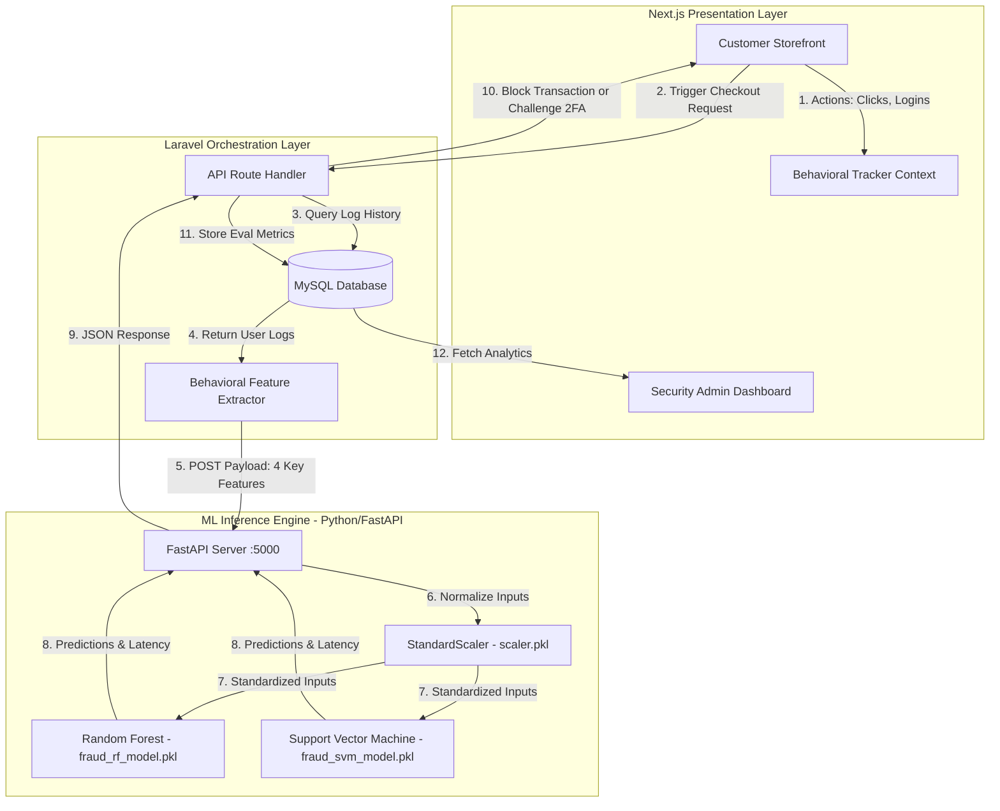

# Detailed Integration Plan: Behavioral-Based Fraud Detection System (Random Forest vs. SVM)

This document outlines the step-by-step integration blueprint to deploy and evaluate a comparative fraud detection system utilizing **Random Forest (RF)** and **Support Vector Machine (SVM)** algorithms within the ShopDee e-commerce ecosystem.

---

## 1. Executive Summary & AI Model Review

### Objectives of the AI Integration
*   **Performance Comparison:** Run Random Forest (RF) and Support Vector Machine (SVM) models in parallel to evaluate execution latency, prediction accuracy, and F1-score in a live production-like environment.
*   **Behavioral Diagnostics:** Focus on non-financial user interactions (behavioral features) rather than purchase history alone. This allows proactive bot and account-takeover detection.
*   **Real-time Decision Making:** Build an asynchronous orchestration pipeline where the machine learning engine processes checkout actions and prompts immediate security interventions (e.g., OTP challenges) if risk thresholds are breached.

### Algorithm Specifications & Preprocessing
*   **Random Forest (RF):** An ensemble learning classifier consisting of multiple decision trees. RF is robust against overfitting, handles nonlinear relationships effectively, and excels at classifying complex behavioral features (e.g., erratic click speeds).
*   **Support Vector Machine (SVM):** A classification algorithm that determines the optimal hyperplane separating fraud and non-fraud classes. Since SVM is highly sensitive to feature scales, a standard scaling pipeline is mandatory.
*   **SMOTE (Synthetic Minority Over-sampling Technique):** Because fraud samples are naturally rare (<1% of typical e-commerce transactions), SMOTE is applied during offline training to generate synthetic fraud samples. This balances the dataset, preventing the classifiers from biassing towards the "non-fraudulent" majority class.

---

## 2. Architecture & Data Flow

The system employs a decoupled **Three-Tier Architecture** consisting of the **Next.js Presentation Layer**, the **Laravel Orchestration Layer**, and the **Python/FastAPI Machine Learning Inference Engine**.

### System Architecture Diagram


### Detailed Step-by-Step Data Flow
1.  **User Action Tracking:** The Next.js frontend captures client-side metrics (e.g., failed logins, session duration, click rates) using a React Context.
2.  **Checkout Triggers:** When a user clicks "Proceed to Checkout", a payment request is dispatched to the Laravel Backend.
3.  **Behavioral Feature Extraction:** Rather than passing raw telemetry, Laravel queries `user_activity_logs` in MySQL and calculates **4 Normalized Behavioral Features**:
    *   `failed_login_attempts`: Total unsuccessful login attempts within the past 24 hours.
    *   `time_to_checkout`: Time elapsed (seconds) from the initial login timestamp to the checkout button click.
    *   `ip_distance`: Distance (km) between the current request IP and the last recorded successful login location.
    *   `amount_deviation`: Ratio comparing the current order total against the user's historical 10-order average.
4.  **Inference Dispatch:** Laravel posts these 4 features to the Python ML Engine (`http://localhost:5000/api/predict`).
5.  **Data Standardisation & Model Evaluation:**
    *   The Python service loads the pickled scaler and normalizes the features.
    *   Both models (RF and SVM) run inference asynchronously.
    *   The API records exact inference latencies using CPU microsecond timers.
6.  **Response Orchestration:** The Python service returns predictions from both models, their relative confidence, and latency metrics.
7.  **Dynamic Mitigation:** If either model labels the session as fraudulent (Class 1), Laravel pauses checkout, flags the transaction, and returns a challenge request (e.g., 2FA verification) to Next.js.
8.  **Admin Evaluation:** Dashboard pulls execution metrics from Laravel to visualize comparative benchmarks (Accuracy, Latency, F1-scores).

---

## 3. Implementation Steps

### Step 1: Model Export (Offline Google Colab Training)
Prepare and export models using your Jupyter notebook:
1.  Train on [IEEE-CIS Fraud Detection](https://www.kaggle.com/c/ieee-fraud-detection) or custom synthetic behavioral logs.
2.  Balance classes using SMOTE: `from imblearn.over_sampling import SMOTE`.
3.  Standardize features: `from sklearn.preprocessing import StandardScaler`.
4.  Serialize and dump binaries:
    ```python
    import joblib
    joblib.dump(rf_model, 'fraud_rf_model.pkl')
    joblib.dump(svm_model, 'fraud_svm_model.pkl')
    joblib.dump(standard_scaler, 'scaler.pkl')
    ```

### Step 2: Set Up Machine Learning Engine (Python/FastAPI)
Create a new directory named `shopdee-ai` at the root of the ShopDee project.

1.  **Configure `requirements.txt`:**
    ```text
    fastapi
    uvicorn
    scikit-learn
    joblib
    pandas
    numpy
    ```
2.  **Develop `api.py` (FastAPI Server):**
    ```python
    from fastapi import FastAPI, HTTPException
    from pydantic import BaseModel
    import joblib
    import time
    import numpy as np

    app = FastAPI(title="ShopDee ML Fraud Detection Engine")

    # Load serialized artifacts
    try:
        scaler = joblib.load("models/scaler.pkl")
        rf_model = joblib.load("models/fraud_rf_model.pkl")
        svm_model = joblib.load("models/fraud_svm_model.pkl")
    except Exception as e:
        print(f"Error loading models: {e}")

    class PredictionInput(BaseModel):
        failed_login_attempts: int
        time_to_checkout: float
        ip_distance: float
        amount_deviation: float

    @app.post("/api/predict")
    def predict(data: PredictionInput):
        # 1. Shape input vector
        features = np.array([[
            data.failed_login_attempts,
            data.time_to_checkout,
            data.ip_distance,
            data.amount_deviation
        ]])
        
        # 2. Standardize features
        scaled_features = scaler.transform(features)
        
        # 3. Random Forest Inference
        start_rf = time.process_time()
        rf_pred = int(rf_model.predict(scaled_features)[0])
        rf_prob = float(rf_model.predict_proba(scaled_features)[0][1])
        rf_time = (time.process_time() - start_rf) * 1000 # convert to ms
        
        # 4. SVM Inference
        start_svm = time.process_time()
        svm_pred = int(svm_model.predict(scaled_features)[0])
        # Note: Set probability=True during training to enable predict_proba for SVM
        try:
            svm_prob = float(svm_model.predict_proba(scaled_features)[0][1])
        except Exception:
            svm_prob = 1.0 if svm_pred == 1 else 0.0
        svm_time = (time.process_time() - start_svm) * 1000 # convert to ms

        return {
            "random_forest": {
                "prediction": rf_pred,
                "probability": rf_prob,
                "latency_ms": rf_time
            },
            "svm": {
                "prediction": svm_pred,
                "probability": svm_prob,
                "latency_ms": svm_time
            }
        }
    ```

### Step 3: Configure Laravel Backend Gateway
1.  **Generate Controller:** Run `php artisan make:controller Api/FraudDetectionController`.
2.  **Add Orchestration Logic:**
    *   Retrieve client headers and credentials.
    *   Aggregate failed login attempts, session delta times, and GeoIP locations.
    *   Send POST payload to `http://localhost:5000/api/predict`.
    *   Log metrics in a `fraud_logs` database table (store predictions, accuracy outputs, and latencies).
    *   If fraud is flagged, interrupt request lifecycle and return verification payload.

### Step 4: Build Next.js Dashboard & Simulator UI
1.  **Simulator Component (`src/components/admin/FraudSimulator.tsx`):**
    *   Develop a form enabling admins to input fake telemetry metrics (failed logins, deviations, coordinates).
    *   Display side-by-side comparison tables detailing classification decisions and processing latencies.
2.  **Evaluation Graphs (`src/components/admin/FraudMetricsChart.tsx`):**
    *   Visualize long-term evaluation scores (F1, Accuracy, Latency distributions) comparing RF vs. SVM using Chart.js or Recharts.

---

## 4. Verification and Local Testing
1.  **Launch all services** locally using the startup automation launcher:
    ```powershell
    ./s.ps1
    ```
2.  **Simulate standard transactions:** Verify that standard mock checkouts succeed immediately with minimal routing latency.
3.  **Simulate suspicious behavior:** Inject inputs like `failed_login_attempts: 12`, `time_to_checkout: 1.2s` (typical brute-force bot speed) via the Admin Simulator. Verify that the ML Engine immediately flags the request and the UI renders the appropriate security challenges.
